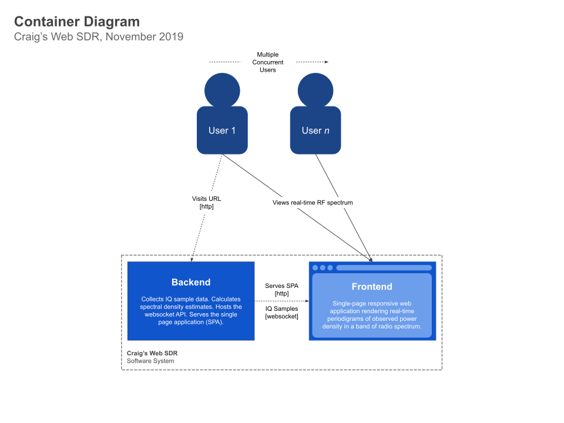

# Craig's Web SDR

View radio spectrum in real-time via a cheap RTL SDR dongle. This is just
a toy project for me to explore some software development ideas.

# Developer Setup

## Software Architecture

I wanted to try the [C4 Model](https://c4model.com/). The following diagrams zoom in from a high level *System Context*, through a *Container* level view and finally down to a software *Component* view.

Diagrams usually end up stale. One idea could be to capture them as code using the [FC4 Framework](https://fundingcircle.github.io/fc4-framework/) but for now they are produced by hand in Google Drawings. Taking a step back, only the Component diagram looks useful to me and my IDE can instantly draw a fairly convincing one of those at any time from a snapshot of the source code.

## The TODO List

In this project, i'm experimenting with replacing my normal TODO.md file with (acceptance) test cases. There's been some merit to this but they can't really replace simple task lists for keeping me focussed and on-track.

### Project

* [X] ~~*Complete a spike to learn FastAPI, asyncio, pyRtlsdr & SciPy. Work out an architecture that keeps out of the way and makes software changes cheap & fast.*~~ [2019-11-22]

### Server

* [X] ~~*Sketch out a web service using FastAPI*~~ [2019-11-16]
* [X] ~~*Figure out how to read samples asynchronously from the SDR*~~ [2019-11-17]
  * @note I don't get exactly the # of samples asked for every time
* [X] ~~*Publish on github*~~ [2019-11-17]
* [X] ~~*Calculate FFT (DFT) of samples and deliver them via JSON*~~ [2019-11-18]
  * @note too much data for JSON arrays, need to swap string repr (4mb / message) to numeric
  * ~~@followup how to calculate db / freq with numpy?~~
    * Not possible without using a fixed gain and calibrating the receiver
  * ~~@followup how to calibrate the db scale?~~
    * Not practical without a signal of known frequency, bandwidth & power
  * ~~@followup how to limit frequency window?~~
    * The word "window" here could cause confusion with window functions. Size of FFT in scipy / numpy is a function of input ndarray length
* [X] ~~*Write array of uint8, array size = bandwidth*~~ [2019-11-18]
  * ~~@followup what happens with concurrent WS users?~~
    * Each results in an async co-routine being created and has a reference to the websocket
  * ~~@followup how to pause the stream after all WS clients gone?~~
    * Happens automatically, if there are no clients, there are no running coroutines
* [ ] Specify pydantic types for FastAPI to auto-produce the OpenAPI descriptor
* [ ] Use the spike experience to re-build the service sketch, nicely
* [ ] Change architecture to improve use of parallel cpu cores
  * put sdr reading & SDE calculation in another process (parallelism avoiding Python's GIL)
  * use async comms to transfer the small (<= 2048 element ndarray>) to the webserver thread
  * see also: https://stackoverflow.com/questions/15639779/why-does-multiprocessing-use-only-a-single-core-after-i-import-numpy

### Client

* [ ] Serve a svelte SPA
  * @followup how does the svelte build pipeline work?
* [ ] Render periodigrams
  * @followup what's a performant way to draw a periodigram?
  * @followup can a 2d canvas be GPU-accelerated in the browser?

### Docs

* [X] ~~*Finish writing up the developer setup notes*~~ [2019-11-24]
* [X] ~~*Create C4 Model diagrams*~~ [2019-11-23]

## Developer Environment Setup

### Requirements

* Windows, Linux or MacOS
* Python 3.7+ - an up to date version of pip is required

### Steps

1. `cd backend`
1. Create a Python virtualenv `python -m venv venv` and activate it
1. Install the dependencies into the venv, I had to update pip first
    1. `python -m pip install -U pip`
    1. `pip install -r requirements.txt` will install this package in editable mode into the venv alongside all the dependencies
1. Launch your editor, i'm trialling VS Code for this project instead of my usual Intellij with the Python plugin
1. Run the tests, either `python setup.py test` or `pytest` are supported. There are differences but they are mitigated in the project setup
